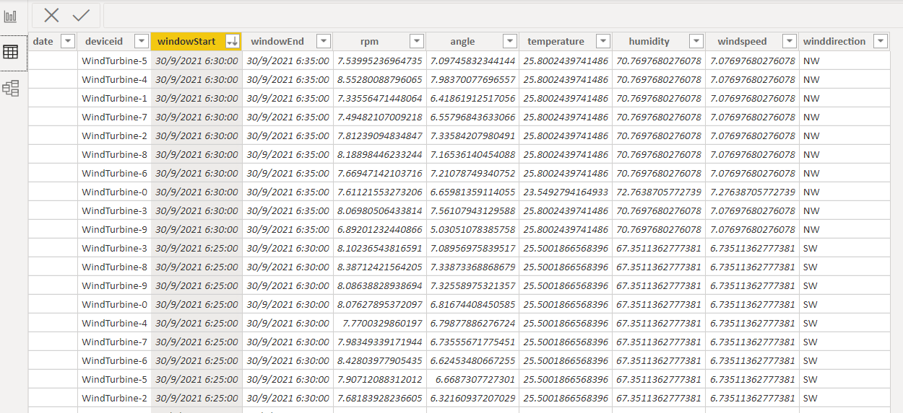

# Structured Streaming in Azure Synapse

With the rise of IoT and machine learning, there is an increasing demand for real-time insights on constantly flowing data.

Born from the legacy Azure SQL DW, Synapse is typically brought up in the context of more traditional Data Warehousing, with batch processing serving SQL layers for BI Developers to run reports off.

However, new updates in Azure Synapse have made it possible to build a robust data lake-house, able to process and serve data as it comes.

## Databricks vs Synapse

The conversation of data lake houses, data streaming, and machine learning is often directed towards the King Pin of distributed cloud processing: Databricks. There are many benefits that Databricks brings over Synapse's vanilla version of Apache Spark for example, a shiny new Spark engine, delta table optimisation, integration with MLflow. This article does not aim to invalidate these fantastic features but offers an alternative product to consider.

Indeed Microsoft seems to be pushing Synapse quite heavily with built-in integration to other Microsoft products like Power BI and Azure Data Factory. If you are in the process of designing your new data platform then it's useful to know what tools are out there.

## Our Scenario

We will be adapting the example scenario from Databricks' learning pathway described [here](https://databricks.com/blog/2020/08/03/modern-industrial-iot-analytics-on-azure-part-1.html). This will provide a clear comparison between the two services, and help you distinguish the key differences between them.

## Architecture

The architecture described below is built on three main philosophies.

1. **Independence of compute and storage:** End-users, be they data analysts, data scientists, or business analysts, should be able to access the data through a variety of means. Access to the data should not be limited by the compute used.
2. **Reduce data duplication as much as possible:** The same data should not be duplicated across various locations (separate from redundancy and disaster recovery). If data is to be accessed via different means, then only a single source should be referenced.
3. **Serve data as quickly as possible:** The key distinction from batch processing to stream processing is the ability to get real-time insights on the data coming into our system. We want to be able to serve this data as quickly as possible.

We will not go into too much detail on security and governance instead, we will sketch out an example of how to get usable data as quickly as possible.


If it isn't obvious by this point, the centre point of this solution is Azure Synapse. We will be using a Spark Pool to stream and process the data into the open-source Delta Lake format. Additionally, we will be using the serverless On-Demand SQL Pool to surface our data to BI users.

Supporting our Synapse workspace are three (3) additional resources:

- Azure Storage Account: This Azure storage account is our Gen2 Azure Data Lake. All our data will be stored in a container within this account, organised into separate directories.
- Azure IoT Hub: This hub we will use to manage and route messages from our simulated IoT device
- Azure Key Vault: Here we store secrets and connection strings for all the above resources. Although we will not be discussing security in this post, Azure Synapse's integration with Key Vault makes it easy enough to parse secrets into our scripts without committing the cardinal sin of hard-coding them into our notebooks.

## Data Processing

For our process we will be transitioning data from 3 stages: Bronze *(Raw)*, Silver *(Aggregated)*, Gold *(Enriched)*.


[Image Reference](https://databricks.com/blog/2020/08/11/modern-industrial-iot-analytics-on-azure-part-2.html)

All of our stages will be utilising [Apache Spark's Structured Streaming](https://spark.apache.org/docs/latest/structured-streaming-programming-guide.html#structured-streaming-programming-guide); a micro-batch processing engine built on the Spark SQL engine. Because of this, our data processing can be written using the same forms as our batch processing methods.

In structured streaming, there are three components to a *data stream*: The input source, the stream engine, and the output sink. For each stage, we create the `DataStreamReader` (connect to our source), perform any Spark SQL transformations (using the streaming engine), and create a `DataStreamWriter` (output data to the sink).

The notebook containing all the data processing code can be found on my GitHub [here](https://github.com/BrentonAD/blog-synapse-streaming/blob/main/code/StreamIngestion.ipynb). If you want to compare how this processing would look in Databricks, check out their notebook hosted [here](https://databricks.com/notebooks/iiot/iiot-end-to-end-part-1.html).

### Bronze

The first step in data processing is to configure our ingestion stream from Azure IoT Hub, into the bronze area of our lake.

An obvious difference from Databricks is the lack of dbutils. Luckily, Synapse Spark comes with an analogous module mssparkutils. We can use this module in much the same way, for example: Interacting with the spark file-system, or loading secrets from an associated Azure Key Vault.

When reading from IoT Hub, we set up one stream reader. This simply receives the request and extracts the body information.

```python
# Read directly from IoT Hub using the EventHubs library for Spark
iot_stream = (
	# Read from IoT Hubs directly
	spark.readStream.format("eventhubs")                                               
	# Use the Event-Hub-enabled connect string
    .options(**ehConf)                                                               
	# Load the data
    .load()
    # Extract the "body" payload from the messages
	.withColumn('reading', F.from_json(F.col('body').cast('string'), schema))        
	# Create a "date" field for partitioning
    .select('reading.*', F.to_date('reading.timestamp').alias('date'))               
)
```

A quick note, when setting up our stream from IoT Hub, it is important to use the *Event Hub Compatible connection string*, rather than the *IoT hub connection string*. You can find the correct connection string through the Azure Portal:


If you are unsure, running `iot_stream.status` will confirm whether data is successfully flowing from your IoT Hub.

Next, we perform our transformations. Information from the weather sensors and turbine sensors is coming from the same IoT device, here we separate them only taking the relevant features from the current request. Once the relevant data has been filtered, we crate a `DataStreamWriter` to write each stream to the corresponding location in our data lake. Notice the delta format: this is what allows us to utilise the features of Spark's Delta Lake when querying later.

```python
# Split our IoT Hub stream into separate streams and write them both into their own Delta locations
write_turbine_to_delta = (
	# Filter out turbine telemetry from other data streams
    iot_stream.filter('temperature is null')
    # Extract the fields of interest
    .select('date','timestamp','deviceId','rpm','angle')                             
    # Write our stream to the Delta format
    .writeStream.format('delta')                                                     
    # Partition our data by Date for performance
    .partitionBy('date')                                                             
    # Checkpoint so we can restart streams gracefully
    .option("checkpointLocation", CHECKPOINT_PATH + "turbine_raw")                   
    # Stream the data into an ADLS Path
    .start(BRONZE_PATH + "turbine_raw")                                              
)

write_weather_to_delta = (
  	# Filter out weather telemetry only
    iot_stream.filter(iot_stream.temperature.isNotNull())                              
    .select('date','deviceid','timestamp','temperature','humidity','windspeed','winddirection') 
    # Write our stream to the Delta format
    .writeStream.format('delta')                                                     
    # Partition our data by Date for performance
    .partitionBy('date')                                                             
    # Checkpoint so we can restart streams gracefully
    .option("checkpointLocation", CHECKPOINT_PATH + "weather_raw")                   
    # Stream the data into an ADLS Path
    .start(BRONZE_PATH + "weather_raw")                                              
)

```

Lastly we register these tables with Apache's Hive, which will allow us to run SQL queries within our spark notebook.

```python
# Create the external tables once data starts to stream in
while True:
  try:
    spark.sql(f'CREATE TABLE IF NOT EXISTS turbine_raw USING DELTA LOCATION "{BRONZE_PATH + "turbine_raw"}"')
    spark.sql(f'CREATE TABLE IF NOT EXISTS weather_raw USING DELTA LOCATION "{BRONZE_PATH + "weather_raw"}"')
    break
  except:
    pass
```

### Silver

Now that our data has been saved to our data lake, we can create our second streaming stage with aggregations. Aggregations will make consumption of our telemetry data more accessible. In this example, we will aggregate our telemetry to 5-minute windows.

Because we are streaming data in as soon as it arrives, there is the possibility that messages will arrive late from the IoT device, or that data will change within the aggregation window. We can combat this with Delta Lake's *merge* functionality. The below code defines a function that will append or update data in our target delta table based on the keys (date, windowStart, windowEnd, and deviceid).

```python
# Create functions to merge turbine and weather data into their target Delta tables
def merge_delta(incremental, target): 
  incremental.dropDuplicates(['date','windowStart', 'windowEnd','deviceid']).createOrReplaceTempView("incremental")
  
  try:
    # MERGE records into the target table using the specified join key
    incremental._jdf.sparkSession().sql(f"""
      MERGE INTO delta.`{target}` t
      USING incremental i
      ON i.date=t.date AND i.windowStart = t.windowStart AND i.windowEnd = t.windowEnd AND i.deviceId = t.deviceid
      WHEN MATCHED THEN UPDATE SET *
      WHEN NOT MATCHED THEN INSERT *
    """)
  except:
    # If the †arget table does not exist, create one
    incremental.write.format("delta").partitionBy("date").save(target)
```

Once we have defined the merge behaviour, we can create our streams that read from the Bronze stage of our Delta Lake. Once again, the aggregation operations are no different to how we would manipulate a normal spark DataFrame. Querying embedded JSON-like objects from a Delta Lake is currently not supported in Synapse SQL. For this reason, we must unpack the window object into separate elements so that we can build SQL queries later.

Afterwards, on our `DataStreamWriter`, we call the above merge method to run with every batch.

```python
turbine_b_to_s = (
  	# Read data as a stream from our source Delta table
    spark.readStream.format('delta').table("turbine_raw")                        
    # Aggregate readings to hourly intervals
    .groupBy('deviceId','date',F.window('timestamp','5 minutes'))              
    .agg(F.avg('rpm').alias('rpm'), F.avg("angle").alias("angle"))
    .withColumn("windowStart", F.col('window').start)
    .withColumn("windowEnd", F.col('window').end)
    .drop("window")
    # Write the resulting stream
    .writeStream
    # Pass each micro-batch to a function
    .foreachBatch(lambda i, b: merge_delta(i, SILVER_PATH + "turbine_agg"))    
    # Merge works with update mode
    .outputMode("update")                                                      
    # Checkpoint so we can restart streams gracefully
    .option("checkpointLocation", CHECKPOINT_PATH + "turbine_agg")             
    .start()
)

weather_b_to_s = (
    # Read data as a stream from our source Delta table
  	spark.readStream.format('delta').table("weather_raw")                        
    # Aggregate readings to hourly intervals
    .groupBy('deviceid','date',F.window('timestamp','5 minutes'))              
    .agg({"temperature":"avg","humidity":"avg","windspeed":"avg","winddirection":"last"})
    .withColumn("windowStart", F.col('window').start)
    .withColumn("windowEnd", F.col('window').end)
    .selectExpr('date','windowStart','windowEnd','deviceid','`avg(temperature)` as temperature','`avg(humidity)` as humidity','`avg(windspeed)` as windspeed','`last(winddirection)` as winddirection')
    # Write the resulting stream
    .writeStream
     # Pass each micro-batch to a function
    .foreachBatch(lambda i, b: merge_delta(i, SILVER_PATH + "weather_agg"))   
    # Merge works with update mode
    .outputMode("update")
    # Checkpoint so we can restart streams gracefully
    .option("checkpointLocation", CHECKPOINT_PATH + "weather_agg")             
    .start()
)
```

The ability to create a data stream from a delta lake table was introduced in Spark 3.1, and luckily support for Spark 3.1 in Azure Synapse is now in GA as of May 2021. However, at the time of writing the default Spark version for Synapse Spark Pools was still Spark 2.6, so make sure that you specify version 3.1 when creating your pools.

### Gold

Our final stage simply joins the data from the two aggregated tables (weather and turbine) using [stream-stream joins](https://spark.apache.org/docs/latest/structured-streaming-programming-guide.html#stream-stream-joins) in Spark's Structured Streaming. This creates a new data stream that contains data from both sources.

```python
# Read streams from Delta Silver tables and join them together on common columns (date & window)
turbine_agg = spark.readStream.format('delta').option("ignoreChanges", True).table('turbine_agg')
weather_agg = spark.readStream.format('delta').option("ignoreChanges", True).table('weather_agg').drop('deviceid')
turbine_enriched = turbine_agg.join(weather_agg, ['date','windowStart','windowEnd'])
```

We then use the newly created stream and, after using the same Delta Lake merge function, write the data to the final section of the lake.

```python
# Write the stream to a foreachBatch function which performs the MERGE as before
merge_gold_stream = (
  turbine_enriched
    .selectExpr('date','deviceid','windowStart','windowEnd','rpm','angle','temperature','humidity','windspeed','winddirection')
    .writeStream 
    .foreachBatch(lambda i, b: merge_delta(i, GOLD_PATH + "turbine_enriched"))
    .option("checkpointLocation", CHECKPOINT_PATH + "turbine_enriched")         
    .start()
)
```

At the end of this process, we are left with three populated and constantly updating locations of our lake, ready to be queried and used immediately.


## But Why?

As mentioned at the beginning, Synapse is typically discussed in the context of Data Warehousing. This use case highlights one way Azure Synapse can go far beyond this.

Once we have set up the above streams we can utilise Synapse's built-in SQL engine to query the data. Although a word of warning at the time of writing querying delta lake tables is only possible on On-Demand SQL pools and is in public preview, meaning it is not suitable for production use.


In addition to ad-hoc queries, you can create an external table from the Delta Lake table on the SQL On-Demand pool. This allows BI developers to query the data with T-SQL or connect to the data like a standard Azure SQL server, but with the added benefit of on-demand serverless compute: And the best part is the data never has to leave the storage account!

```sql
USE dw_gold

CREATE EXTERNAL DATA SOURCE IotDeltaLake  
WITH
(    
    LOCATION = 'abfss://iot@<storage-account>.blob.core.windows.net'
) 
GO
CREATE EXTERNAL FILE FORMAT DeltaLakeFormat WITH (  FORMAT_TYPE = DELTA );
GO

CREATE EXTERNAL TABLE turbine_enriched (
    [date] DATETIME,
    [deviceid] VARCHAR(MAX),
    [windowStart] DATETIME,
    [windowEnd] DATETIME,
    [rpm] FLOAT,
    [angle] FLOAT,
    [temperature] FLOAT,
    [humidity] FLOAT,
    [windspeed] FLOAT,
    [winddirection] VARCHAR(4)

) WITH (
        LOCATION = 'gold/turbine_enriched', --> the root folder containing the Delta Lake files
        data_source = IotDeltaLake,
        FILE_FORMAT = DeltaLakeFormat
);
```




Of course, this solution could also be possible with Databricks Spark and Synapse SQL however, the ability to use the same tool reduces architectural complexity, minimises costs, and enhances usability for the end-user. Here lies the true draw of Azure Synapse: *The useful all in one platform*.

I look forward to seeing Delta Lake querying with Synapse SQL come into GA. Once more established, expanding this simple use case into a fleshed out [Kappa architecture](https://milinda.pathirage.org/kappa-architecture.com/) would be an interesting exercise for the future. Think about eliminating those overnight batch jobs, converting every ingestion task into a structured stream from the source!


